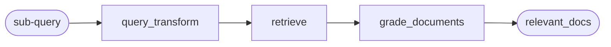

# Agentic RAG Compliance Assistant

Hungarian corporate income tax (TAO) Q&A assistant built around a
**LangGraph** agent on top of a **ChromaDB** vector store with local
**Ollama** models. The agent is designed for the compliance use case:
every answer must cite the underlying NAV source, every numeric example
goes through a deterministic calculator, and a separate judge model
verifies that no claim is invented before the answer reaches the user.

The project is a self-contained demo — a small, opinionated codebase
that can be cloned, brought up with `docker compose` or `uv run`, and
explored end-to-end (chat UI, evaluation harness, load test).

---

## Table of contents

1. [Why agentic RAG here](#1-why-agentic-rag-here)
2. [Architecture](#2-architecture)
3. [Project layout](#3-project-layout)
4. [Quick start](#4-quick-start)
5. [Configuration](#5-configuration)
6. [Data ingestion](#6-data-ingestion)
7. [Running the chat UI](#7-running-the-chat-ui)
8. [Evaluation](#8-evaluation)
9. [Load test](#9-load-test)
10. [Testing & CI](#10-testing--ci)
11. [Design decisions and trade-offs](#11-design-decisions-and-trade-offs)
12. [Future work](#12-future-work)

---

## 1. Why agentic RAG here

Plain RAG (retrieve-then-answer) is brittle on a compliance domain for a
few concrete reasons:

* **Numeric questions** like *"Mennyi a TAO 10 000 000 Ft adóalapra?"*
  cannot be answered by the LLM alone without risking hallucinated
  arithmetic. A dedicated calculator tool keeps the maths deterministic.
* **Cited paragraphs** (`19. §`, `17/A. §`) must actually exist in the
  source corpus, otherwise the answer is misleading. A validator tool
  checks every citation against ChromaDB before the answer is shown.
* **Hallucination control** matters more than fluency. A separate judge
  model re-reads the draft against the retrieved chunks and triggers a
  bounded retry if any claim is unsupported.
* **Scope discipline** — the assistant should politely refuse anything
  outside Hungarian corporate income tax instead of confidently
  hallucinating about, say, VAT.

These constraints justify the extra cost of an agent over a single-shot
RAG chain: each requirement maps to a dedicated node in the graph.

---

## 2. Architecture

### Main agent graph


The main graph has **seven nodes** and **two conditional edges**:

| Node | Model | Responsibility |
|---|---|---|
| `classify_query` | fast (`aya-expanse`) | TAO vs off-topic, structured output |
| `query_decomposer` | main (`qwen2.5`) | Split into 1–3 retrievable sub-queries |
| `retrieve_documents` | — | Runs the RAG subgraph per sub-query, dedupes results |
| `tool_executor` | — | Deterministic: fires `tao_calculator` on HUF amounts, `legal_reference_validator` on every `§` reference |
| `answer_generator` | main (`qwen2.5`) | Drafts the answer from retrieved chunks + tool outputs |
| `hallucination_checker` | judge (`mistral-nemo`) | Structured groundedness verdict; loops back into `answer_generator` up to `MAX_HALLUCINATION_RETRIES` |
| `off_topic_handler` | — | Polite Hungarian refusal |

### RAG subgraph

`retrieve_documents` delegates to an internal three-node graph:



* **query_transform** rewrites the sub-query into a retrieval-friendly
  form (drops question particles, normalises numbers).
* **retrieve** does a top-K similarity search against ChromaDB
  (`bge-m3` embeddings).
* **grade_documents** drops chunks that are obviously off-topic for the
  sub-query. With the dummy provider this is a deterministic keyword
  overlap; with Ollama it is an LLM call with structured output.

### Why these components

| Choice | Reason |
|---|---|
| **LangGraph** | Explicit state-machine fits the compliance requirements (retry budget, conditional branches, audit-friendly per-node logging). Cleaner than a generic ReAct loop for a pipeline with deterministic checkpoints. |
| **Ollama** | Lets the whole stack run locally without external API keys; reviewer can reproduce results offline. Model role split (main / fast / judge / embedding) is configurable per env. |
| **ChromaDB (langchain-chroma)** | Embedded, file-backed, no extra service to operate; appropriate for a corpus of this size (~380 chunks). The `data/chroma/` directory is gitignored so each clone re-indexes from the versioned PDFs. |
| **`pdfplumber` + `pypdf` fallback** | Hungarian NAV PDFs occasionally trip `pdfplumber` on tables / scanned pages; `pypdf` is the safe fallback. |
| **`bge-m3`** | Strong multilingual embedding model that handles Hungarian well; 1024-dim, fits ChromaDB without quantisation. |
| **Separate judge model** | Using the same model as both author and judge biases the verdict ("anchoring"). A different model family (`mistral-nemo`) gives a more honest groundedness signal. |
| **Pydantic-settings + `@lru_cache`** | Centralised, typed config; the cached `get_settings()` makes tests trivial to monkey-patch via env vars. |
| **`uv`** | Fast, reproducible installs from `uv.lock`; same lockfile drives local dev, CI and Docker. |

For a longer write-up see [`docs/architecture.md`](docs/architecture.md).

---

## 3. Project layout

```
app/
  agent/             LangGraph main workflow
    state.py         AgentState TypedDict
    nodes.py         The seven node implementations
    graph.py         build_agent_graph()
    tools/           tao_calculator + legal_reference_validator
  rag/               Ingestion + retriever + RAG subgraph
    splitter.py      Paragraph-aware (§) splitter
    ingestion.py     CLI: load PDFs -> Chroma
    retriever.py     get_vector_store() helper
    subgraph.py      query_transform -> retrieve -> grade_documents
  llm/               Provider abstraction (Ollama + dummy fallback)
  ui/                Streamlit chat UI
  eval/              Labelled dataset, metrics, LLM-judge, CLI runner
  load_test/         Async runner, per-node tracer, matplotlib chart
  config.py          Settings (pydantic-settings)
data/
  documents/         NAV PDF leaflets (versioned in the repo)
  chroma/            Persistent vector store (gitignored)
  eval/              Labelled eval dataset (questions.json)
reports/             Eval + load-test outputs (gitignored)
tests/               Pytest suite (44 tests)
docs/                Architecture notes
Dockerfile, docker-compose.yml
```

---

## 4. Quick start

### Option A — Docker

```powershell
git clone <repo-url>
cd agentic-rag-compliance-assistant
Copy-Item .env.example .env
docker compose up --build
```

The compose file starts two services: `ollama` (model server) and the
app (Streamlit on <http://localhost:8501>). On first run, pull the
models inside the `ollama` container:

```powershell
docker compose exec ollama ollama pull qwen2.5:14b-instruct
docker compose exec ollama ollama pull bge-m3
docker compose exec ollama ollama pull mistral-nemo:12b
docker compose exec ollama ollama pull aya-expanse:8b
```

Then ingest the PDFs once:

```powershell
docker compose exec app uv run python -m app.rag.ingestion --path data/documents
```

### Option B — Local with `uv`

```powershell
git clone <repo-url>
cd agentic-rag-compliance-assistant
Copy-Item .env.example .env
uv sync
uv run python -m app.rag.ingestion --path data/documents
uv run streamlit run app/ui/streamlit_app.py
```

A local Ollama install at `http://localhost:11434` is expected; pull the
same four models with `ollama pull`.

### Option C — Offline / dummy provider

For a quick smoke test without Ollama, set `LLM_PROVIDER=dummy` in
`.env`. All LLM-backed nodes fall back to deterministic behaviour, so
the graph runs end-to-end (the answers are placeholders, but every node
fires and every test passes).

---

## 5. Configuration

All settings live in [`app/config.py`](app/config.py) and can be
overridden via `.env` or process env vars. The most relevant ones:

| Key | Default | Purpose |
|---|---|---|
| `LLM_PROVIDER` | `dummy` | `ollama` for real models, `dummy` for offline determinism |
| `OLLAMA_BASE_URL` | `http://localhost:11434` | Where the Ollama API lives (compose sets it to `http://ollama:11434`) |
| `OLLAMA_MODEL` | `qwen2.5:14b-instruct` | Main model (decomposer + answer generator) |
| `OLLAMA_FAST_MODEL` | `aya-expanse:8b` | Cheap classifier model |
| `OLLAMA_JUDGE_MODEL` | `mistral-nemo:12b` | Separate model for groundedness check |
| `OLLAMA_EMBEDDING_MODEL` | `bge-m3` | Multilingual embeddings |
| `RAG_TOP_K` | `5` | Top-K retrieved chunks per sub-query |
| `MAX_HALLUCINATION_RETRIES` | `2` | Cap on the grounded-answer loop |
| `CHROMA_PERSIST_DIR` | `./data/chroma` | Where ChromaDB persists |

See [`.env.example`](.env.example) for the full list with comments.

---

## 6. Data ingestion

```powershell
uv run python -m app.rag.ingestion --path data/documents
```

The CLI walks the directory, extracts text with `pdfplumber` (or
`pypdf` if pdfplumber returns an empty page), splits each document on
Hungarian `§` paragraph boundaries with a fall-back recursive splitter
inside long paragraphs, embeds the chunks with `bge-m3`, and upserts
them into ChromaDB with stable IDs (`{source}::p{page}::c{chunk_id}`)
so re-running is idempotent. Provenance is preserved in
`metadata.section` so the validator tool and the UI can surface it.

---

## 7. Running the chat UI

```powershell
uv run streamlit run app/ui/streamlit_app.py
```

The UI streams each node as it executes (Hungarian step labels in a
`st.status` panel), then renders the final answer plus dedicated cards
for `tao_calculator` outputs and `legal_reference_validator` verdicts.
Every retrieved source chunk is available in an expander with its file
name, section and page number, so the user can audit the answer in two
clicks. Multi-turn chat history is kept in `st.session_state`, and the
graph is compiled once per process with an in-memory `MemorySaver`
checkpointer so each session has its own `thread_id`.

---

## 8. Evaluation

```powershell
uv run python -m app.eval.runner
uv run python -m app.eval.runner --no-judge          # skip LLM-judge
uv run python -m app.eval.runner --limit 5 --out reports/quick.csv
```

The dataset (`data/eval/questions.json`) holds **15 labelled Hungarian
TAO questions** with the expected `§` references and a few mandatory
key terms; one is intentionally off-topic to catch over-eager routing.
For each question the runner records:

* `category_correct` — TAO vs off-topic classifier accuracy
* `recall_at_k` — fraction of expected `§` sections present in any
  retrieved chunk
* `citation_accuracy` — fraction of `§` references in the answer that
  are backed by a retrieved chunk (penalises invented citations)
* `terms_coverage` — fraction of `expected_terms` present in the answer
* `grounded` — final-state grounded flag (after retries)
* `latency_s` — total invocation time
* `judge_groundedness / judge_relevance / judge_completeness` — 1–5
  scores from `mistral-nemo` for the in-scope questions

Outputs land in `reports/eval.csv` plus a stdout summary.

---

## 9. Load test

```powershell
uv run python -m app.load_test.runner --n 50 --concurrency 5
uv run python -m app.load_test.runner --n 100 --concurrency 1 --no-chart
```

The harness drives a realistic query mix (factual lookups, calculations
that trigger `tao_calculator`, explicit `§` citations that trigger
`legal_reference_validator`, plus two off-topic queries) through
`graph.ainvoke` with an `asyncio.Semaphore` for bounded concurrency. A
small `trace_node_timings()` context manager monkey-patches every node
to record per-call durations, exposing **p50 / p95 / p99** per node.

Outputs:

* `reports/load_test_per_query.csv` — one row per query
* `reports/load_test_per_node.csv` — per-node percentile table
* `reports/load_test_per_node.png` — grouped bar chart (p50 / p95 / p99
  per node)
* Stdout: end-to-end and per-node summary tables

The chart makes it easy to spot the dominant nodes (typically
`answer_generator` and `retrieve_documents`) and any long-tail
behaviour under concurrency.

---

## 10. Testing & CI

```powershell
uv run pytest -q
```

The suite (44 tests) covers:

* Configuration & provider factory (`test_config.py`, `test_llm_provider.py`)
* RAG splitter, ingestion idempotency, retriever round-trip, subgraph
  (`test_rag.py`)
* Tools — calculator rate / loss cap, validator parsing & lookup
  (`test_tools.py`)
* Agent graph — classifier, off-topic short-circuit, tool firing,
  grounded loop, memory checkpoint (`test_agent.py`)
* Eval — metric correctness, dataset shape, runner end-to-end on a
  fixture (`test_eval.py`)
* Load test — percentiles, tracer patch/restore, runner with chart
  (`test_load_test.py`)

All tests run against the dummy provider (no Ollama required), so the
suite is fast (< 5 s) and deterministic for CI.

---

## 11. Design decisions and trade-offs

* **Explicit `StateGraph` over a ReAct agent.** The retry loop with a
  bounded counter, the deterministic tool firing on regex-detected
  amounts / citations, and the off-topic short-circuit are all easier
  to reason about and test as edges in a graph. ReAct would have hidden
  these inside an LLM-driven loop.
* **Two-stage pipeline (sub-graph + main graph) instead of one
  monolithic graph.** Lets the RAG layer be reused in eval and tested
  independently of the agent (`test_rag.py`).
* **Deterministic tool fallbacks.** `tao_calculator` and
  `legal_reference_validator` do not call an LLM. This is the right
  default for a compliance domain: numbers and citations should never
  be hallucinated.
* **Judge model ≠ author model.** Using `mistral-nemo` to grade
  `qwen2.5` reduces self-confirmation bias compared with using the
  same model for both roles.
* **Dummy provider in CI.** Every LLM-backed node has a deterministic
  fallback when `LLM_PROVIDER=dummy`, so the full graph runs offline.
  This is what lets the 44-test suite finish in seconds.
* **Tools as one-module-per-file subpackage.** Keeps the boundary
  between deterministic and LLM-driven logic visible and makes it
  easy to bind them to `chat.bind_tools` later if we want to mix in
  an LLM-orchestrated tool-calling node.
* **Versioned PDFs in the repo.** ~2 MB total. Trades a bit of repo
  bloat for full reproducibility: anyone can clone and run the
  pipeline with no manual download.

---

## 12. Future work

* **Per-domain expansion.** Today the assistant is single-domain
  (TAO). The same graph would extend to ÁFA / KIVA / járulékok with an
  additional classifier branch and a per-domain retriever (separate
  ChromaDB collection).
* **CRAG-style web fallback.** If `grade_documents` returns nothing
  relevant, fall back to a web search (e.g. NAV.hu) before answering
  — useful for very recent rule changes.
* **Token-level streaming in the UI.** Currently the answer is
  rendered as a whole after `hallucination_checker` returns; streaming
  the draft would improve perceived latency.
* **Postgres-backed checkpointer.** `MemorySaver` is process-local;
  swapping in `PostgresSaver` would let conversation state survive a
  restart and scale beyond a single Streamlit worker.
* **CI workflow.** A GitHub Actions workflow running `uv sync` +
  `pytest -q` + the eval runner with `--no-judge` would catch
  regressions automatically.
