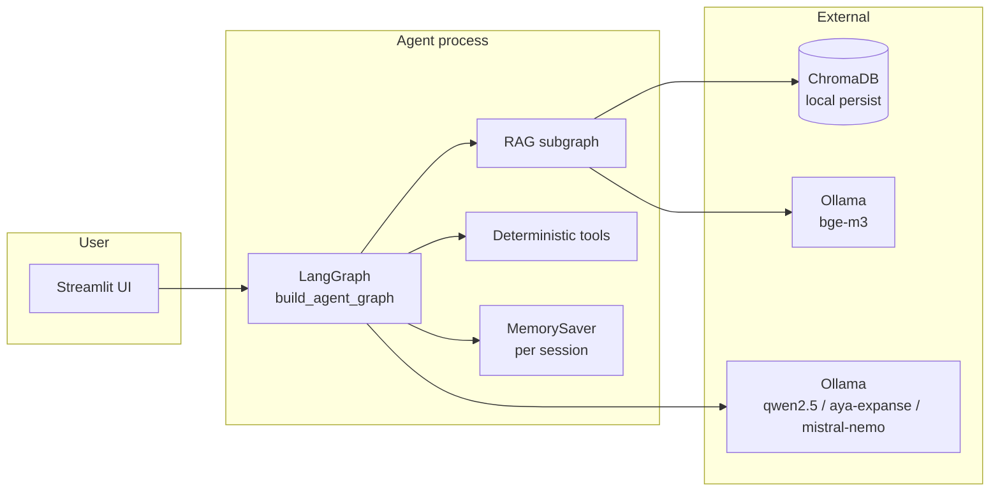

# Architecture notes

This document complements the README with a deeper look at the
agent's runtime behaviour, the trade-offs behind each component, and a
few things that intentionally stayed out of scope.

---

## 1. Runtime topology



* The Streamlit process owns one compiled graph instance (cached via
  `@st.cache_resource`).
* `MemorySaver` is process-local — per-thread state survives between
  turns of the same session but not across restarts.
* ChromaDB is embedded (no separate service); the persist directory is
  mounted into the container.
* Ollama runs as a sibling container in docker-compose; locally it is
  expected on `http://localhost:11434`.

---

## 2. State

The agent state is a `TypedDict` with `total=False` so each node
returns a partial update:

| Field | Type | Owner |
|---|---|---|
| `query` | `str` | UI / runner |
| `category` | `"tao"` \| `"off_topic"` | `classify_query` |
| `sub_queries` | `list[str]` | `query_decomposer` |
| `retrieved_docs` | `list[Document]` | `retrieve_documents` |
| `tool_results` | `list[dict]` | `tool_executor` |
| `draft_answer` | `str` | `answer_generator` |
| `hallucination_retries` | `int` | `hallucination_checker` |
| `grounded` | `bool` | `hallucination_checker` |
| `final_answer` | `str` | `hallucination_checker` / `off_topic_handler` |

The UI reads `final_answer`, `tool_results` and `retrieved_docs` to
render its three sections (answer text, tool cards, source expanders).
The eval runner reads the same fields plus `category` and `grounded`.

---

## 3. Tool firing policy

`tool_executor` is pure Python — no LLM call. It looks at the original
query and:

* Calls `tao_calculator(tax_base_huf=…)` if the query contains a HUF
  amount **and** any of `"adó"` / `"tao"`. Multi-parameter cases (e.g.
  including a carried-forward loss in the same query) are out of scope
  for the regex extractor; the calculator itself supports the loss
  parameter and is exercised that way in tests and from the eval CSV.
* Calls `legal_reference_validator(citation=…)` for **every** matched
  `N. §` / `N/L. §` token in the query.

Tool outputs land in `state["tool_results"]` and are pulled into the
answer prompt as additional context. Errors are caught per tool and
surfaced as `{"tool": ..., "error": "..."}` so a single tool failure
cannot break the whole graph.

This design keeps the tool layer **inspectable** (it's easy to predict
which tools will fire for a given query) and **safe** (no LLM-driven
argument hallucination).

---

## 4. Grounded-answer loop

The hallucination checker:

1. Runs the judge model with structured output (`grounded: bool`,
   `reason: str`).
2. If `grounded` is true → write `final_answer = draft_answer` and
   return.
3. If `grounded` is false and `hallucination_retries <
   MAX_HALLUCINATION_RETRIES` → increment the counter and route back
   to `answer_generator`.
4. Otherwise accept the current draft (rather than loop forever).

This is a deliberately small, explicit loop. A more aggressive design
could also re-trigger retrieval with a critique-driven query rewrite
(CRAG-style); that is listed under future work.

---

## 5. Provider abstraction

`app/llm/provider.py` exposes:

```python
get_chat_model(role: Literal["main", "fast", "judge"]) -> BaseChatModel
get_embedding_model() -> Embeddings
```

Behind the scenes:

* `LLM_PROVIDER=ollama` returns `ChatOllama` / `OllamaEmbeddings`
  configured with the matching model name from settings.
* `LLM_PROVIDER=dummy` returns a `DummyChatModel` and
  `DummyEmbeddings`. The dummy chat model echoes the prompt with a
  role-prefixed marker; the dummy embedding is a hashed 64-dim vector
  in `[-1, 1)`. This is enough for the graph to run end-to-end in
  CI and for retrieval tests to be deterministic against an in-memory
  ChromaDB collection.

`reset_provider_cache()` clears the `@lru_cache` so tests can swap
providers in a fixture.

---

## 6. Things deliberately out of scope

* **Authentication / multi-tenant separation.** This is a demo, not a
  production deployment. Adding it would mean a gateway in front of
  Streamlit, a per-tenant ChromaDB collection, and per-user
  checkpointers — none of which would change the agent design.
* **PII / data residency controls.** All data stays on the developer's
  machine; the NAV PDFs are public.
* **Long-document summarisation.** The corpus today is small enough
  (~380 chunks) that we can pass relevant snippets directly. For a
  larger compliance corpus a map-reduce summarisation pass before the
  answer generator would make sense.
* **Online evaluation / A/B.** The eval harness is offline against a
  fixed labelled set; production observability would need request
  tracing and feedback capture.
